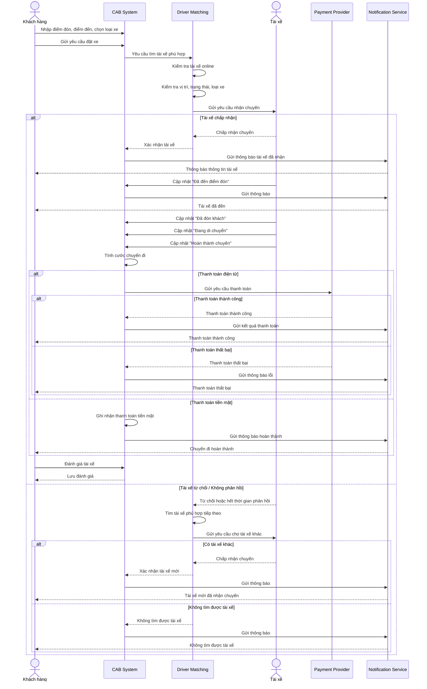

# PHÂN TÍCH YÊU CẦU HỆ THỐNG CAB SYSTEM – NỀN TẢNG ĐẶT XE

## B1. Đọc hiểu yêu cầu để xây dựng hệ thống

### 1. Yêu cầu kinh doanh

* Xây dựng nền tảng CAB System phục vụ đặt xe trực tuyến.
* Hỗ trợ 3 nhóm người dùng chính: **Khách hàng, Tài xế và Nhân viên vận hành**.
* Tự động hóa việc tìm kiếm và phân công tài xế.
* Quản lý tập trung chuyến đi, thanh toán, thông báo và dữ liệu người dùng.
* Hệ thống có khả năng mở rộng khi số lượng khách hàng và tài xế tăng.
* Có khả năng bổ sung tính năng, phương thức thanh toán và nhà cung cấp dịch vụ trong tương lai.
* Thời gian xây dựng và triển khai: **7 tuần**.

### 2. Quy trình nghiệp vụ chính

**Đặt xe → Tìm tài xế → Phân công tài xế → Tài xế đến đón → Đón khách → Thực hiện chuyến đi → Hoàn thành chuyến → Tính cước → Thanh toán → Đánh giá tài xế.**

### 3. Yêu cầu chức năng

**Khách hàng:**

* Đăng ký tài khoản.
* Đăng nhập.
* Cập nhật thông tin cá nhân.
* Nhập điểm đón và điểm đến.
* Lựa chọn loại xe.
* Gửi yêu cầu đặt xe.
* Theo dõi trạng thái chuyến đi.
* Xem thông tin tài xế và thời gian dự kiến đến.
* Xem lịch sử chuyến đi.
* Xem số tiền phải thanh toán.
* Thanh toán bằng tiền mặt hoặc phương thức điện tử.
* Đánh giá tài xế sau chuyến đi.

**Tài xế:**

* Đăng ký hoặc được nhân viên tạo tài khoản.
* Cập nhật thông tin cá nhân và phương tiện.
* Bật/tắt trạng thái sẵn sàng nhận chuyến.
* Nhận thông báo chuyến mới.
* Chấp nhận hoặc từ chối chuyến.
* Cập nhật trạng thái chuyến đi.
* Chia sẻ vị trí để hệ thống tìm tài xế phù hợp.
* Xem thông tin chuyến và khách hàng.

**Nhân viên vận hành:**

* Quản lý khách hàng.
* Quản lý tài xế.
* Quản lý phương tiện.
* Theo dõi các chuyến đang diễn ra.
* Kiểm tra trạng thái tài xế.
* Hỗ trợ xử lý chuyến bị lỗi.
* Tra cứu lịch sử giao dịch.
* Phân quyền tài khoản nhân viên.
* Theo dõi báo cáo chuyến đi, doanh thu, tỷ lệ hoàn thành và tỷ lệ hủy.

**Hệ thống:**

* Tự động tìm tài xế phù hợp.
* Ưu tiên tài xế gần khách hàng và đang sẵn sàng.
* Tự động tìm tài xế khác khi tài xế từ chối hoặc không phản hồi.
* Tính cước chuyến đi.
* Tích hợp với bên cung cấp thanh toán.
* Gửi thông báo cho khách hàng và tài xế.
* Lưu lịch sử và nhật ký các thao tác quan trọng.

### 4. Yêu cầu phi chức năng

* **Hiệu năng:** Hệ thống phải đáp ứng được lượng lớn người dùng và hoạt động ổn định vào giờ cao điểm.
* **Khả năng mở rộng:** Các thành phần có thể mở rộng độc lập khi tải tăng.
* **Bảo mật:** Bảo vệ thông tin cá nhân, phương tiện, vị trí và giao dịch.
* **Phân quyền:** Kiểm soát quyền truy cập đối với các chức năng quản trị.
* **Độ tin cậy:** Lỗi ở thanh toán hoặc thông báo không được làm toàn bộ hệ thống đặt xe ngừng hoạt động.
* **Khả năng bảo trì:** Có thể thay đổi hoặc nâng cấp từng thành phần mà hạn chế ảnh hưởng đến hệ thống.
* **Khả năng mở rộng chức năng:** Có thể bổ sung dịch vụ, phương thức thanh toán và kênh thông báo mới.

### 5. Quy tắc nghiệp vụ

* Chỉ tài khoản đã xác thực mới được sử dụng các chức năng yêu cầu đăng nhập.
* Tài xế chỉ nhận chuyến khi đang ở trạng thái sẵn sàng.
* Tài xế được ưu tiên dựa trên vị trí, trạng thái và các tiêu chí vận hành.
* Nếu tài xế không phản hồi hoặc từ chối, hệ thống tiếp tục tìm tài xế khác.
* Nếu không tìm được tài xế, hệ thống phải thông báo cho khách hàng.
* Chuyến đi chỉ được thanh toán sau khi hoàn thành theo chính sách doanh nghiệp.
* Thông tin thanh toán nhạy cảm không được lưu trực tiếp trên hệ thống CAB.
* Các thao tác quản trị quan trọng phải được phân quyền và lưu vết.
* Một chuyến đi phải có trạng thái rõ ràng trong suốt quá trình xử lý.

---

## B2. Xác định các bên liên quan (Stakeholder)

| Stakeholder             | Vai trò                         | Mối quan tâm                              | Mức độ quan trọng |
| ----------------------- | ------------------------------- | ----------------------------------------- | ----------------- |
| Khách hàng              | Người đặt xe                    | Đặt xe nhanh, theo dõi chuyến, thanh toán | Cao               |
| Tài xế                  | Người thực hiện chuyến          | Nhận chuyến phù hợp, cập nhật trạng thái  | Cao               |
| Nhân viên vận hành      | Quản lý hoạt động               | Theo dõi và xử lý chuyến                  | Cao               |
| Ban giám đốc            | Chủ đầu tư                      | Doanh thu, hiệu quả, khả năng mở rộng     | Cao               |
| Bộ phận IT              | Phát triển và vận hành hệ thống | Ổn định, bảo mật, dễ bảo trì              | Cao               |
| Nhà cung cấp thanh toán | Xử lý giao dịch                 | Thanh toán chính xác và an toàn           | Trung bình        |
| Nhà cung cấp thông báo  | Gửi thông báo                   | Đảm bảo thông báo đến người dùng          | Trung bình        |

### Vấn đề cần khắc phục

* Phân công tài xế còn thực hiện thủ công.
* Khách hàng khó theo dõi trạng thái chuyến.
* Thông tin thanh toán chưa được quản lý tập trung.
* Khó xử lý khi tài xế từ chối hoặc không phản hồi.
* Khó mở rộng hệ thống khi số lượng người dùng tăng.
* Việc quản lý và theo dõi hoạt động vận hành còn hạn chế.

---

## B3. Xác định mục đích nghiệp vụ

Mục đích của hệ thống CAB là **tự động hóa toàn bộ quy trình đặt xe**, từ lúc khách hàng tạo yêu cầu đến khi chuyến hoàn thành, thanh toán và đánh giá.

Hệ thống cần hỗ trợ:

* Đặt xe trực tuyến.
* Tự động tìm và phân công tài xế.
* Theo dõi trạng thái chuyến.
* Tính cước.
* Thanh toán tiền mặt hoặc điện tử.
* Gửi thông báo.
* Quản lý và báo cáo hoạt động.
* Tạo nền tảng có khả năng mở rộng trong tương lai.

---

## B4. Xác định phạm vi dự án

### Trong phạm vi

* Quản lý tài khoản khách hàng và tài xế.
* Quản lý phương tiện.
* Đặt và quản lý chuyến đi.
* Tìm kiếm và phân công tài xế.
* Theo dõi trạng thái chuyến.
* Tính cước.
* Thanh toán tiền mặt và thanh toán điện tử thông qua nhà cung cấp bên ngoài.
* Gửi thông báo.
* Đánh giá tài xế.
* Quản trị và phân quyền.
* Báo cáo cơ bản.
* Lưu lịch sử và nhật ký hoạt động.

### Ngoài phạm vi hoặc chưa xác định

* Chi tiết công thức tính cước.
* Tiêu chí chính xác để ưu tiên tài xế.
* Thời gian tài xế phải phản hồi.
* Chính sách hủy chuyến.
* Cách xử lý khi mất kết nối mạng.
* Thời gian lưu trữ dữ liệu.
* Các dịch vụ mới chưa được doanh nghiệp yêu cầu.

**Thời gian thực hiện dự án: 7 tuần**, vì vậy cần ưu tiên các chức năng cốt lõi trước.

---

## B5. Phân rã chức năng

### Chức năng đặt xe

* Nhập điểm đón.
* Nhập điểm đến.
* Chọn loại xe.
* Gửi yêu cầu đặt xe.
* Theo dõi trạng thái.

### Chức năng tìm tài xế

* Kiểm tra tài xế đang online.
* Xác định vị trí tài xế.
* Lọc theo loại xe phù hợp.
* Tính khoảng cách giữa tài xế và khách hàng.
* Xác định tài xế phù hợp.
* Gửi yêu cầu nhận chuyến.
* Tìm tài xế tiếp theo nếu bị từ chối hoặc hết thời gian phản hồi.

### Chức năng chuyến đi

* Tài xế xác nhận chuyến.
* Cập nhật đã đến điểm đón.
* Cập nhật đã đón khách.
* Cập nhật đang di chuyển.
* Cập nhật hoàn thành chuyến.

### Chức năng thanh toán

* Tính cước.
* Chọn phương thức thanh toán.
* Thanh toán tiền mặt.
* Thanh toán điện tử.
* Xử lý giao dịch thất bại.
* Lưu thông tin giao dịch.

### Chức năng thông báo

* Thông báo nhận yêu cầu.
* Thông báo tài xế nhận chuyến.
* Thông báo tài xế đến.
* Thông báo hoàn thành chuyến.
* Thông báo kết quả thanh toán.
* Thông báo chuyến mới cho tài xế.

---

## B6. Xác định các yêu cầu chưa rõ cần làm rõ

Business Analyst cần trao đổi với khách hàng để xác định:

* Công thức tính cước cụ thể là gì?
* Giá có thay đổi theo thời gian hoặc nhu cầu hay không?
* Tiêu chí ưu tiên tài xế được xác định như thế nào?
* Tài xế có bao nhiêu giây/phút để phản hồi?
* Sau bao nhiêu lần từ chối thì xử lý như thế nào?
* Chính sách hủy chuyến của khách hàng và tài xế?
* Khi mất mạng thì trạng thái chuyến được xử lý ra sao?
* Thanh toán thất bại được thử lại bao nhiêu lần?
* Dữ liệu vị trí được lưu trong bao lâu?
* Lịch sử chuyến đi được lưu trong bao lâu?
* Những chức năng nào nhân viên thường được phép sử dụng?
* Những thao tác nào chỉ quản lý mới được thực hiện?

---

## B7. Vẽ Use Case Diagram

### Các Actor chính

* **Customer (Khách hàng)**
* **Driver (Tài xế)**
* **Operation Staff (Nhân viên vận hành)**
* **Payment Provider (Nhà cung cấp thanh toán)**
* **Notification Provider (Nhà cung cấp thông báo)**

### Các Use Case chính

* Đăng ký / Đăng nhập.
* Quản lý thông tin cá nhân.
* Đặt xe.
* Tìm tài xế.
* Nhận chuyến.
* Theo dõi chuyến.
* Cập nhật trạng thái chuyến.
* Tính cước.
* Thanh toán.
* Gửi thông báo.
* Đánh giá tài xế.
* Quản lý khách hàng.
* Quản lý tài xế.
* Quản lý phương tiện.
* Quản lý chuyến đi.
* Tra cứu giao dịch.
* Xem báo cáo.
* Phân quyền người dùng.

---

## B8. Đặc tả Use Case

Mỗi Use Case cần xác định:

* **Tên Use Case**
* **Actor**
* **Mục tiêu**
* **Điều kiện tiên quyết**
* **Luồng chính**
* **Luồng thay thế**
* **Luồng ngoại lệ**
* **Điều kiện kết thúc**

### Ví dụ: Use Case "Đặt xe"

**Actor:** Khách hàng

**Mục tiêu:** Khách hàng tạo được yêu cầu đặt xe.

**Luồng chính:**

1. Khách hàng đăng nhập.
2. Nhập điểm đón và điểm đến.
3. Chọn loại xe.
4. Hệ thống kiểm tra thông tin.
5. Hệ thống tạo yêu cầu chuyến.
6. Hệ thống tìm tài xế phù hợp.
7. Gửi thông báo cho khách hàng khi có tài xế nhận chuyến.

**Luồng ngoại lệ:**

* Thông tin điểm đón/điểm đến không hợp lệ.
* Không tìm được tài xế.
* Tài xế từ chối chuyến.
* Hệ thống mất kết nối.

---

## B9. Phân tích quy trình nghiệp vụ bằng Sequence Diagram

# B9. Sequence Diagram – Quy trình đặt xe

## Mô tả ngắn

**Luồng chính:**
Khách hàng đặt xe → CAB System tiếp nhận → Driver Matching tìm tài xế → Tài xế nhận chuyến → Thực hiện chuyến → Hoàn thành → Tính cước → Thanh toán → Đánh giá.

**Luồng ngoại lệ:**
Nếu tài xế từ chối hoặc không phản hồi, hệ thống tự động tìm tài xế khác. Nếu không có tài xế phù hợp, hệ thống thông báo cho khách hàng.

**Thành phần tham gia:**

* **Khách hàng:** Tạo yêu cầu, theo dõi và đánh giá chuyến.
* **CAB System:** Điều phối và quản lý toàn bộ quy trình.
* **Driver Matching:** Tìm và lựa chọn tài xế phù hợp.
* **Tài xế:** Nhận chuyến và cập nhật trạng thái.
* **Payment Provider:** Xử lý thanh toán điện tử.
* **Notification Service:** Gửi thông báo đến khách hàng và tài xế.

## B10. Phân tích quy tắc nghiệp vụ (Business Rules)

| Mã   | Quy tắc nghiệp vụ                                                                            |
| ---- | -------------------------------------------------------------------------------------------- |
| BR01 | Khách hàng phải đăng nhập trước khi đặt xe.                                                  |
| BR02 | Tài xế phải ở trạng thái sẵn sàng mới được nhận chuyến.                                      |
| BR03 | Tài xế được lựa chọn dựa trên vị trí, trạng thái và tiêu chí vận hành.                       |
| BR04 | Nếu tài xế từ chối hoặc không phản hồi, hệ thống phải tìm tài xế khác.                       |
| BR05 | Nếu không có tài xế phù hợp, hệ thống phải thông báo cho khách hàng.                         |
| BR06 | Chuyến đi phải có trạng thái rõ ràng từ lúc tạo đến khi hoàn thành hoặc hủy.                 |
| BR07 | Cước phí được xác định dựa trên loại dịch vụ và thông tin chuyến đi.                         |
| BR08 | Khách hàng có thể thanh toán bằng tiền mặt hoặc phương thức điện tử được hỗ trợ.             |
| BR09 | Thông tin thanh toán nhạy cảm không được lưu trực tiếp trên CAB System.                      |
| BR10 | Giao dịch thanh toán thất bại phải được thông báo và xử lý lại theo chính sách doanh nghiệp. |
| BR11 | Chỉ người dùng có quyền mới được thực hiện các chức năng quản trị.                           |
| BR12 | Các thao tác quản trị quan trọng phải được ghi nhận vào nhật ký hệ thống.                    |
| BR13 | Khách hàng chỉ được đánh giá tài xế sau khi chuyến đi hoàn thành.                            |
| BR14 | Hệ thống phải gửi thông báo khi xảy ra các sự kiện quan trọng của chuyến đi.                 |
| BR15 | Các thành phần của hệ thống cần có khả năng mở rộng độc lập khi tải tăng.                    |

### Kết quả phân tích

Qua quá trình phân tích, Business Analyst cần làm rõ **phạm vi, Actor, Use Case, quy trình nghiệp vụ, yêu cầu chức năng, yêu cầu phi chức năng, Business Rules và các trường hợp ngoại lệ** trước khi nhóm phát triển bắt đầu xây dựng hệ thống CAB trong thời gian **7 tuần**.
